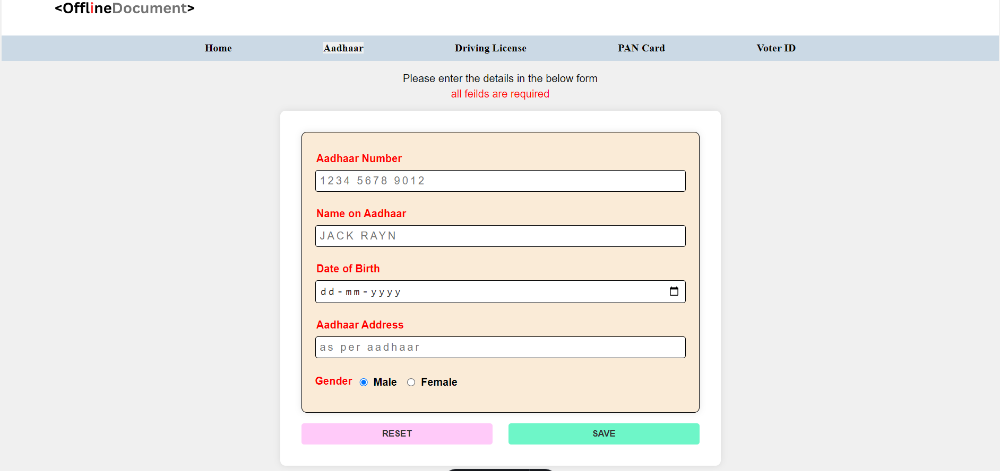
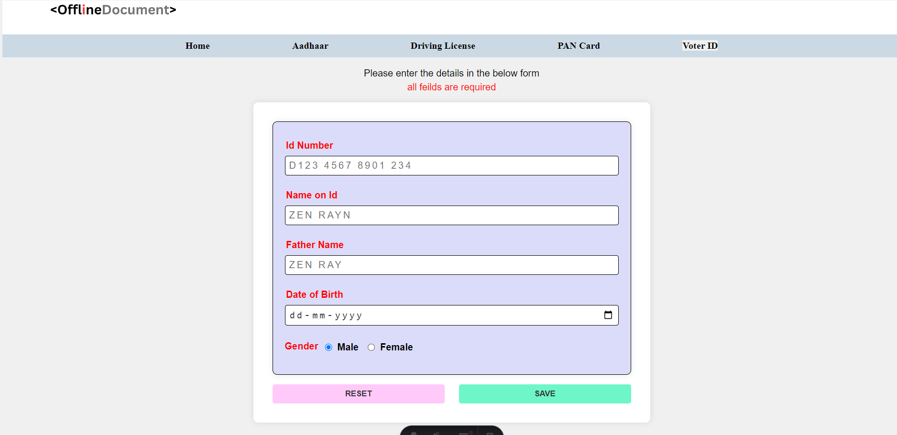
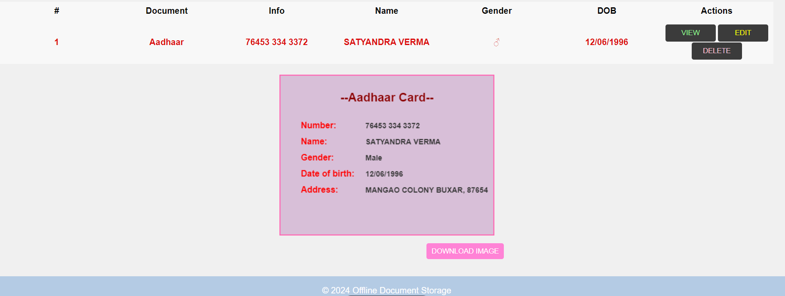
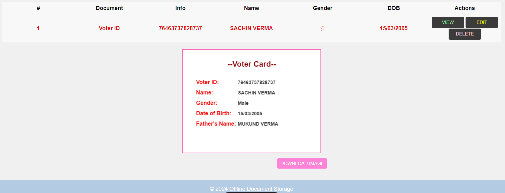
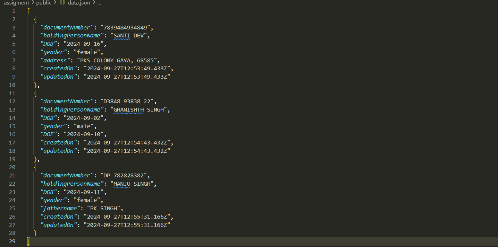

# Offline Document Storage

An offline application to store and manage personal documents such as Aadhaar Card, Driving License, and PAN Card.

## Table of Contents

- [Offline Document Storage](#offline-document-storage)
  - [Table of Contents](#table-of-contents)
  - [Installation](#installation)
  - [Introduction](#introduction)
  - [Features](#features)
  - [Usage](#usage)
  - [Project Structure](#project-structure)
  - [Screenshots](#screenshots)
    - [Document Entry Page](#document-entry-page)
    - [Forms Section](#forms-section)
    - [Data tabel and Canvas image](#data-tabel-and-canvas-image)

## Installation

To set up the project, clone the repository

```bash
npm install
npm run dev
```

run server separately

```bash
npm run server
```

## Introduction

 The Offline Document Storage is a simple yet efficient tool designed to help users store and manage their important personal documents offline. It provides a user-friendly interface to add, view, edit, and delete document details.

## Features

- Add various document types including Aadhaar Card, Driving License, and PAN Card.
- View stored document details.
- Edit and update document information.
- Delete unnecessary or outdated document entries.
- Offline functionality ensures data security and privacy.

## Usage

1. Open the index.html file in your browser.
2. Select the document type from the dropdown.
3. Fill in the document details.
4. Click on Save Details to save the document information.
5. View, edit, or delete saved document details.

## Project Structure

```sh
D: 
ASTRO
├── .astro
├── .vscode
├── node_modules
├── public
│   ├── assets
│   │   └── images
│   └── styles
│       └── aadhaar.css
|       └── dl.css
|       └── pan.css
|        └── style.css 
├── src
|   ├── components
│   │   └── Nav.astro
│   ├── layouts
│   │   └── MainLayout.astro
│   └── pages
│   │   └── aadhaar.astro
|   │   └── dl.astro
|   │    └── index.astro
|   │     └── pan.astro 
│   └── script
│       └── Action.js
|       └── app.js
|       
├── package.json
├── tsconfig.json
```

## Screenshots

Here are some screenshots of the application:

### Document Entry Page


 Entry Page consist of front ui of the application with the options of forms selection in form of Nav links 

### Forms Section


This page consist of aadhaar form , the tabel which stores the form data 


This page consist of Pan form , the tabel which stores the form data 


This page consist of dl form , the tabel which stores the form data 


This page consist of dl form , the tabel which stores the form data 

### Data tabel and Canvas image


the tabel data showing is showing in below canvas Image with the option of download them


the tabel data showing is showing in below canvas Image with the option of download them


the tabel data showing is showing in below canvas Image with the option of download them


the tabel data showing is showing in below canvas Image with the option of download them


 This section consists of the data stored in backends


