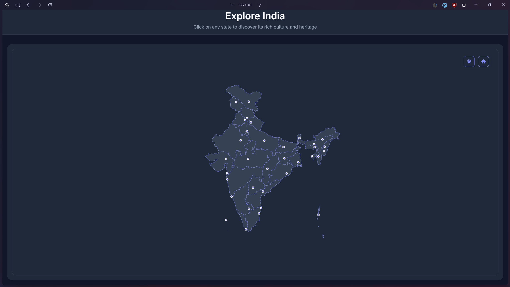

# Interactive India Map Explorer

An interactive web application that visualizes India's states and union territories, providing detailed information about each region's culture, demographics and heritage.



## Website Link

Visit the live application at [Explore India Map](https://india-map.netlify.app).

## Features

- Interactive SVG map of India with clickable states
- State capitals marked with interactive markers
- Detailed modal view for each state showing:
  - Capital city
  - Area
  - Languages
  - Traditional dance forms
  - Literacy rate
  - Brief description
- Dark/Light theme toggle
- Responsive design
- Zoom and pan controls
- Copy state information functionality

## Getting Started

### Prerequisites

- A modern web browser
- Local development server (e.g., Live Server for VS Code)

### Installation

1. Clone the repository:
2. Start a local development server. If using VS Code:
    - Install "Live Server" extension
    - Right click on src/index.html
    - Select "Open with Live Server"
3. Open <http://localhost:5500/src> in your browser

### Project Structure

```plaintext
src/
├── css/
│   ├── components/
│   │   ├── controls.css
│   │   ├── header.css
│   │   ├── map.css
│   │   ├── modal.css
│   │   └── themes.css
│   └── main.css
├── data/
│   ├── india.geojson
│   └── state_data.json
├── js/
│   ├── config/
│   │   └── mapConfig.js
│   ├── modules/
│   │   ├── IndiaMap.js
│   │   ├── StateModal.js
│   │   └── ThemeToggle.js
│   └── main.js
└── index.html
```

## Technical Approach

### Architecture

- Pure JavaScript with ES6 modules
- D3.js for map visualization and interactions
- CSS variables for theming
- JSON data storage for state information

### Key Features Implementation

1. **Map Visualization**
    - Uses D3.js Mercator projection
    - SVG path elements for states
    - Interactive capital markers
2. State Information
    - Modal-based detail view
    - Copy to clipboard functionality
    - Rich cultural and demographic data
3. User Interface
    - Dark/Light theme switcher
    - Zoom controls
    - Responsive layout

### Key Design Decisions

1. **Modular Structure**: Separated components into distinct modules for better maintainability
    - `IndiaMap.js`: Core map visualization
    - `StateModal.js`: Modal display and interactions
    - `ThemeToggle.js`: Theme switching functionality
2. **Responsive Design**:
    - Fluid layout that adapts to different screen sizes
    - Dynamic recalculation of map dimensions on window resize
3. **Performance Optimizations**:
    - Event delegation for map interactions
    - Efficient D3.js selections
    - Clean-up handlers to prevent memory leaks

## Areas for Improvement

1. **Performance**
    - Implement lazy loading for state data
    - Add caching for frequently accessed information
2. **Features**
    - Add search functionality
    - Include more detailed statistics
    - Add animation transitions between states
3. **Accessibility**
    - Enhance keyboard navigation
    - Add ARIA labels for better screen reader support
4. **Data**
    - Include historical data
    - Add economic indicators
    - Include population statistics

## Known Issues

1. Capital markers may overlap in densely populated regions
2. Zoom behaviour needs fine-tuning when zooming out
3. Copy functionality might not work in some older browsers

## Acknowledgments

- D3.js community for visualization tools
- Indian government data portals for state information

## License

This project is licensed under the MIT License - see the [LICENSE](LICENSE) file for details.

